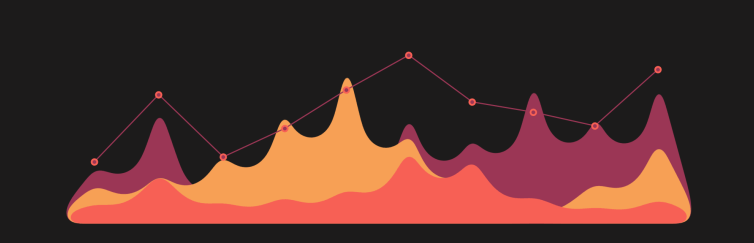

    

<h1 align="center">Hi 👋, I'm Aftab Uddin</h1>
<!-- <h3 align="center">Exploring Data Science: Insights from an Evolving Perspective</h3> -->
<!-- {:target="_blank"}  -->

    

  
 

- 🌱 I’m currently learning **advanced ML & DL** 

- 👨‍💻 All of my projects are available at <a href="https://www.aftabby.com/projects" target="_blank" rel="noopener noreferrer">Projects</a>

- 💬 Ask me about **python, pandas, seaborn, TensorFlow**

- 📫 Reach me at **mail@aftabby.com**

- 📄 Visit portfolio <a href="aftabby.com" target="_blank" rel="noopener noreferrer">aftabby</a>

   

<h2 align="center">Connect with me:</h2>

 

<h2 align="center">Languages and Tools:</h2>

                      

   

    
    

  
<!--

 
&nbsp;

  

 
 -->

  

